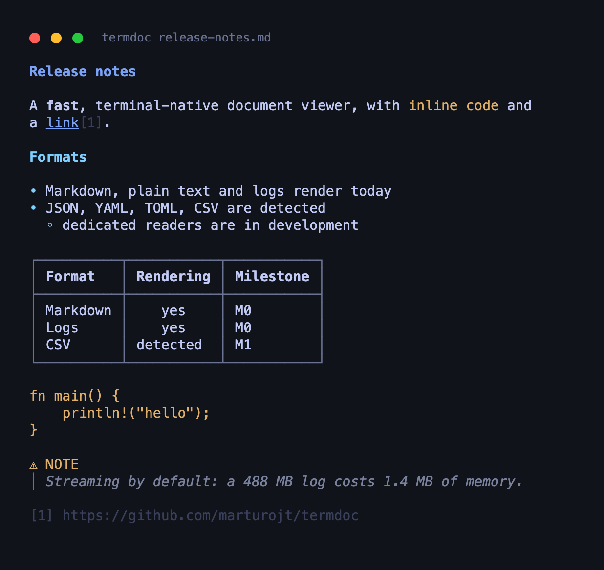

# termdoc

**View documents without leaving the terminal.**

[](https://crates.io/crates/termdoc)
[](https://github.com/marturojt/termdoc/actions/workflows/ci.yml)
[](https://docs.rs/termdoc-core)
[](#license)
[](https://github.com/marturojt/termdoc/releases/latest)
[](https://www.rust-lang.org)



A fast, terminal-native document viewer. One command for whatever document is in
front of you, instead of a different tool for every file type.

**Markdown, plain text, logs, JSON, YAML, TOML, XML and CSV render today.** Many more formats are already
recognised, and their dedicated readers are being added one milestone at a time —
[what works right now](#supported-formats) is spelled out below, precisely.

It is not an editor. It is not a converter. It is not an IDE.

## Install

```bash
cargo install termdoc
```

Or take a **prebuilt binary** from the
[latest release](https://github.com/marturojt/termdoc/releases/latest) — macOS universal,
Linux x86_64 and aarch64, Windows x86_64, with `SHA256SUMS.txt` covering every archive:

```bash
tar -xzf termdoc-v0.1.0-universal-apple-darwin.tar.gz
./termdoc README.md
```

Installing from source requires Rust 1.85+ ([rustup.rs](https://rustup.rs)). All three
platforms are covered by CI, and every released binary is executed by CI before the release
is drafted. A Homebrew formula is on the [roadmap](#roadmap).

## Quick start

```bash
termdoc README.md                 # colourised, wrapped, tables aligned
termdoc application.log           # streamed, line breaks preserved, never reflowed
termdoc minified.json             # parsed and re-indented into a readable tree
termdoc config.yaml               # comments kept, keys and values coloured
termdoc Cargo.toml                # same for TOML: tables, arrays, multi-line strings
termdoc feed.xml                  # tags, attributes, comments and CDATA told apart
termdoc data.csv                  # a table: aligned, wrapped, numbers right-aligned
termdoc --explain odd.dat         # why it chose that format, then exit
termdoc --formats                 # what this build can actually read
```

It reads stdin too, so it drops into a pipeline without ceremony:

```bash
cat README.md | termdoc           # detected by content, no filename needed
git show HEAD:README.md | termdoc
curl -sL https://example.com/x.md | termdoc
```

And it behaves when it is not the last command in the line:

```bash
termdoc huge.log | head -5        # exits on SIGPIPE like cat, no panic
termdoc *.md | grep -i TODO
termdoc report.md > plain.txt     # no ANSI when stdout is not a terminal
```

When stdout is a terminal, output is colourised and fitted to the width. When it
is a pipe or a redirection, **stdout carries only the document** — warnings and
diagnostics go to stderr, always. That is the difference between a tool you can
script and one you have to work around.

## Why termdoc?

The terminal already has excellent specialised viewers: `bat` for source, `glow`
for Markdown, `jq` for JSON, `less` for everything else, and a separate
application entirely once a PDF or a `.docx` shows up. Each is good at its job.

The friction is not any one of them — it is having to remember which one to reach
for, and dropping out of the terminal when the answer is "none of them".

**One command. Different documents. The same terminal-native workflow.**

termdoc is not trying to replace those tools; for a single format, a specialist
will usually go deeper. It is trying to be the thing you type when you do not want
to think about the format at all — and to behave like a proper Unix utility while
doing it.

## Supported formats

`termdoc --formats` prints this list for the binary you actually have installed.

| Format | Detected | Renders |
|---|:---:|:---:|
| Markdown | ✅ | ✅ |
| Plain text | ✅ | ✅ |
| Logs | ✅ | ✅ |
| JSON | ✅ | ✅ |
| YAML | ✅ | ✅ |
| TOML | ✅ | ✅ |
| XML | ✅ | ✅ |
| HTML | ✅ | 🚧 |
| CSV | ✅ | ✅ |
| Source code | ✅ | 🚧 |
| PDF | ✅ | ⛔ |
| DOCX · ODT | ✅ | ⛔ |
| EPUB | ✅ | ⛔ |
| XLSX · PPTX | ✅ | ⛔ |

✅ works today  ·  🚧 reader in development, shown as plain text with a warning
·  ⛔ recognised, but this build cannot display it yet

The distinction is deliberate. A recognised text format still gets shown — as
plain text, with a warning on stderr, because mid-roadmap that beats refusing to
open the file. `--strict` turns that warning into a non-zero exit if you would
rather a script stopped. A recognised **binary** format exits with an error
instead of dumping bytes at your terminal.

Encoding is resolved separately and does work today: BOM, then UTF-8 validation,
then statistical detection, with `--encoding` to override. A latin-1 file renders
with its accents.

## Fast by design

Measured during development on an Apple silicon laptop, with
[`scripts/perf-gate.py`](scripts/perf-gate.py) — which runs in CI on every commit,
so these are gates rather than one-off claims. They are not promises about your
hardware.

| | |
|---|---|
| Startup | **~3.9 ms** (budget: 10 ms) |
| Own memory | **~1.4 MB** while walking a **488 MB** log (budget: 50 MB) |
| Tests | **258**, green on Linux, macOS and Windows |

The memory figure is the process's *anonymous* memory, not RSS: with `mmap`, RSS
tracks the file size through clean page-cache pages the process does not own.

What makes it hold: the document is an **event stream** borrowing from the input,
never a materialised tree, so `termdoc huge.log | head -5` reads a few pages
instead of the whole file.

## How it works

```
Source ──▶ Detect ──▶ Reader ──▶ Event stream ──▶ Layout ──▶ Backend ──▶ stdout
```

Every stage is a trait, and the stages cannot see each other — a reader that could
reach a backend would end up emitting ANSI, so Cargo's dependency graph simply does
not contain that edge, and [a test](crates/termdoc-cli/tests/layering.rs) fails if
one appears.

Degradation is an input rather than a chain of special cases: the terminal's real
capabilities are detected once, and every ladder reads from that value — colour
truecolor → 256 → 16 → none, tables box-drawing → ASCII → TSV, links OSC 8 →
numbered references. With colour off, not one escape byte is emitted.

## Principles

- Do one thing well: turn documents into readable terminal output.
- Near-instant startup.
- Low memory, even with enormous files.
- Correct with pipes and scripts.
- Never open an external application.
- Graceful degradation is a principle, not a detail.

## Roadmap

**Now** — Markdown · plain text · logs · JSON · YAML · TOML · XML
**Next** — syntax-highlighted source
**Then** — the interactive pager: scrolling, search, table-of-contents navigation
**Later** — HTML · PDF · DOCX · ODT · EPUB · images, then plugins

Milestones, with their reasoning and acceptance criteria, are in
[`docs/DESIGN.md`](docs/DESIGN.md) §11. Current state and what is being worked on
next: [`docs/HANDOFF.md`](docs/HANDOFF.md).

> **Note**
> There is no interactive pager yet — that is milestone M2. Today termdoc writes
> its output and exits, which pipes into `less` perfectly well in the meantime.

## Status

**v0.1.0 · M0 complete, M1 in progress.**

Stable today: Markdown, plain text, logs, JSON, YAML, TOML, XML and CSV. In progress: syntax-highlighted source code and the dedicated log reader, then
richer formats. The API of the library crates is **unstable before 1.0** — they
are published so the binary can be, not because anything should be built on them
yet. `1.0` is gated on freezing the document model and the plugin protocol.

## Development

```bash
cargo test --workspace
cargo clippy --workspace --all-targets -- -D warnings
cargo build --release && python3 scripts/perf-gate.py
```

The architecture is documented in [`docs/DESIGN.md`](docs/DESIGN.md), and
[`CLAUDE.md`](CLAUDE.md) holds the working rules for this repository — invariants,
gotchas and the five levels of the test suite.

## Contributing

The layering exists precisely so that adding a format does not mean understanding
the whole pipeline: a reader depends on `termdoc-core` and nothing else. See
[`CONTRIBUTING.md`](CONTRIBUTING.md), which points at the step-by-step recipe for
[adding a document reader](CLAUDE.md#adding-a-reader).

Issues and pull requests are welcome — particularly readers for the formats marked
🚧 above.

## License

MIT OR Apache-2.0, at your option.
